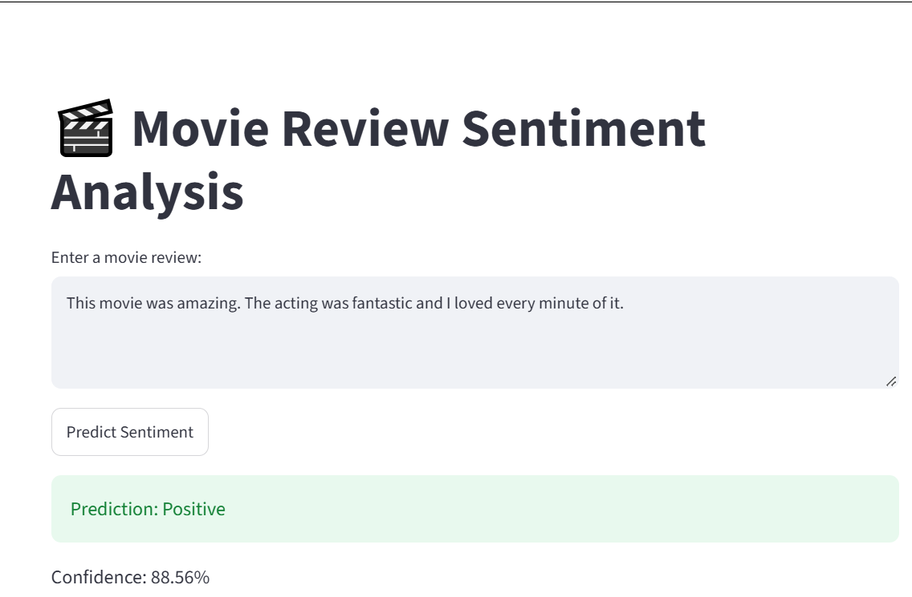
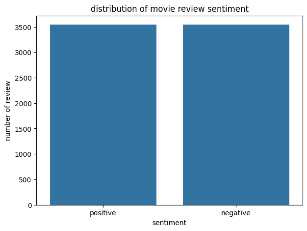
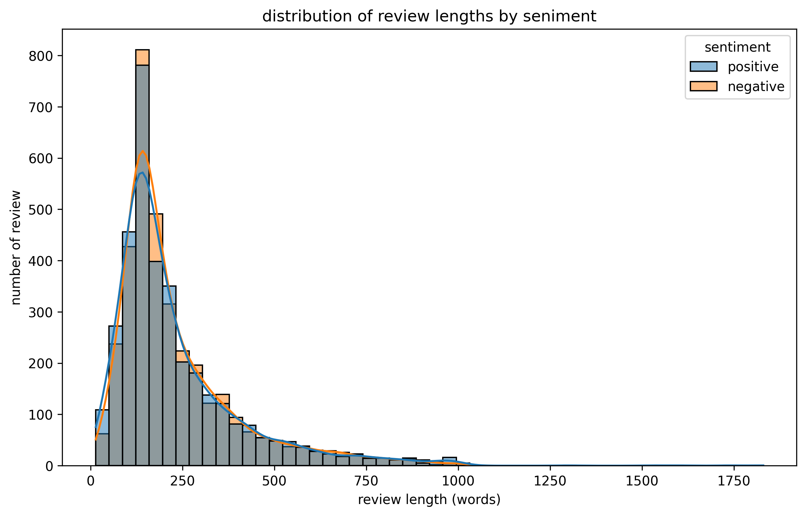
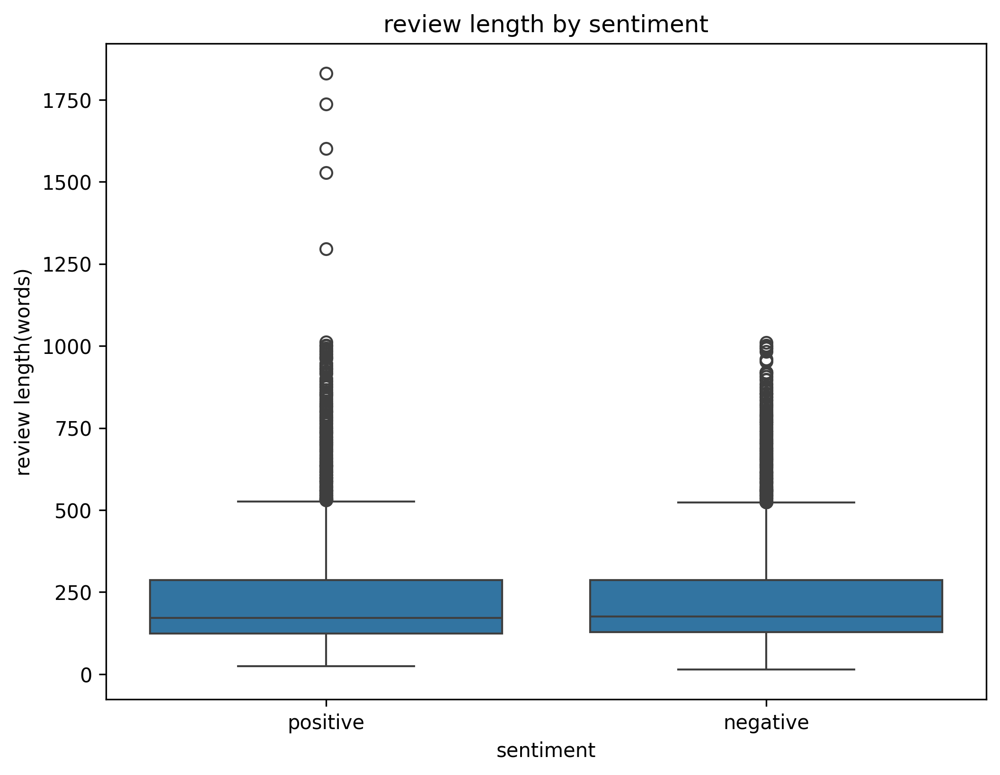
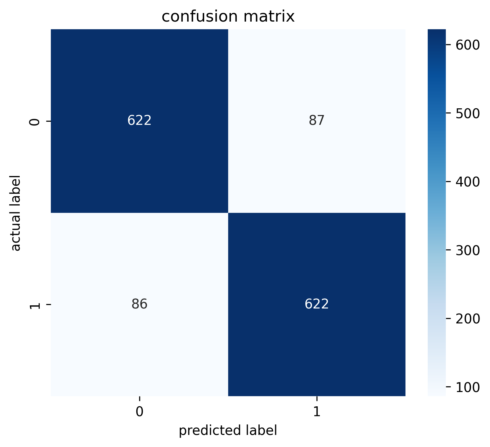
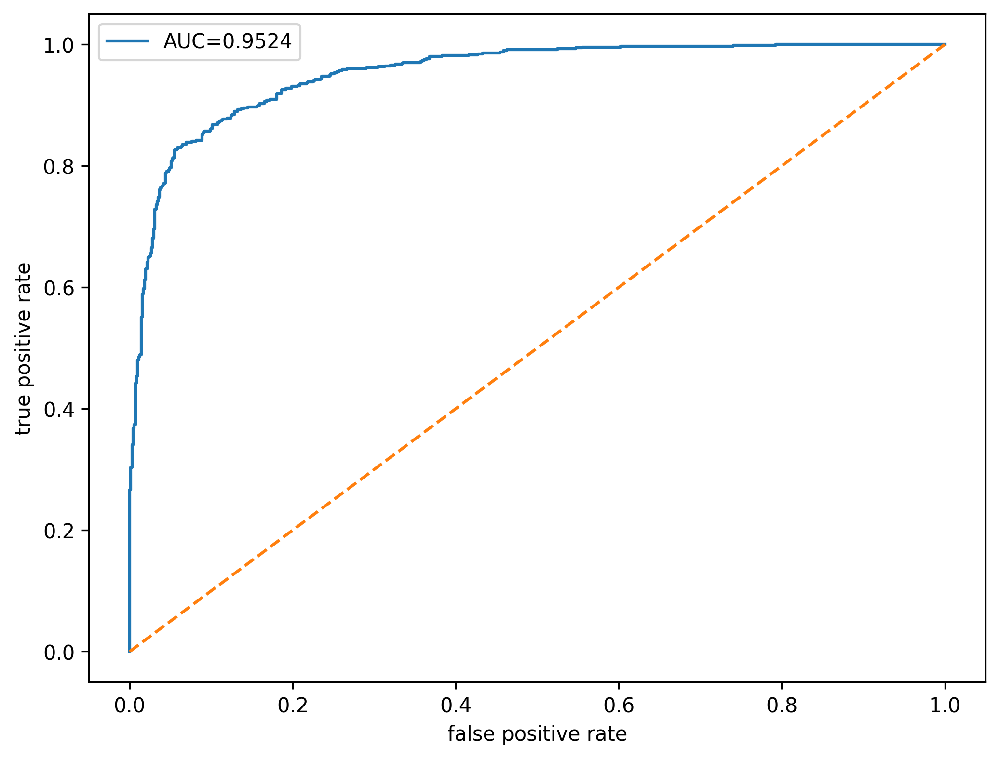
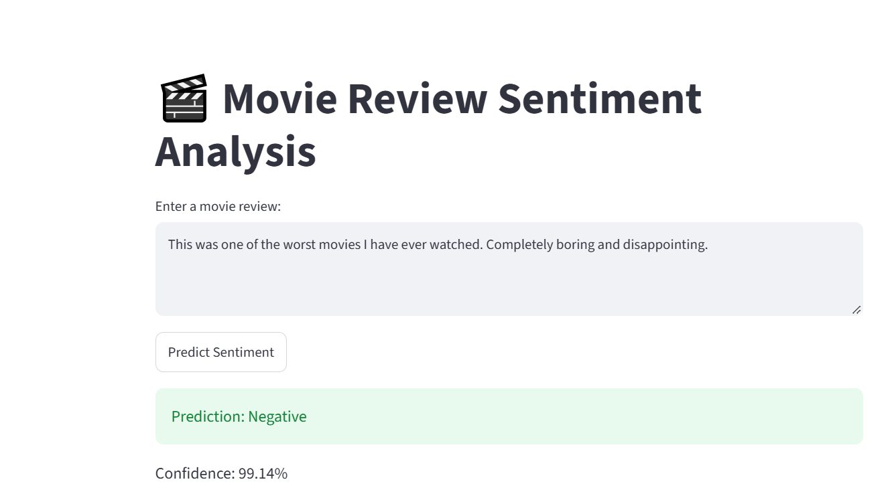
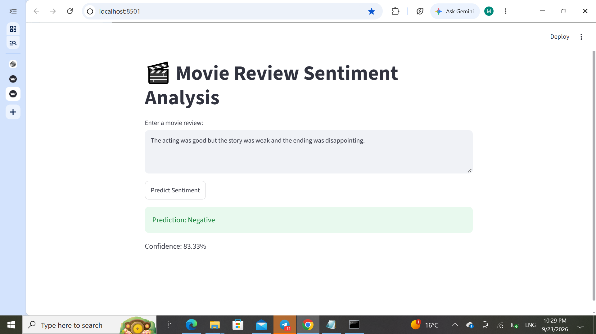

# 🎬 Movie Review Sentiment Analysis



## 📌 Project Overview

This project builds an end-to-end Natural Language Processing (NLP) and Machine Learning system that classifies IMDb movie reviews as either **Positive** or **Negative**.

The model was trained using the IMDb Dataset of 50K Movie Reviews and deployed with a Streamlit web application for real-time sentiment prediction.

---

## 🎯 Business Problem

Movie review platforms receive thousands of user reviews every day.

Manually analyzing reviews is time-consuming and difficult to scale.

This project demonstrates how NLP and Machine Learning can automatically classify reviews as positive or negative, helping businesses understand customer opinions more efficiently.

Potential applications include:

- Customer feedback analysis
- Product review classification
- Social media sentiment analysis
- Brand reputation monitoring
- Opinion mining

---

## 📂 Dataset

**Dataset:** IMDb Dataset of 50K Movie Reviews

Source:

https://www.kaggle.com/datasets/lakshmi25npathi/imdb-dataset-of-50k-movie-reviews

### Dataset Information

- Original Reviews: 50,000
- Labels:
  - Positive
  - Negative

### Data Cleaning

Performed:

- Missing value check
- Duplicate review detection
- Duplicate removal
- HTML tag removal
- URL removal
- Lowercasing
- Punctuation removal
- Extra whitespace removal

After removing duplicates:

- Reviews Remaining: 49,582

---

## 🛠 Technologies Used

- Python
- Pandas
- NumPy
- Matplotlib
- Seaborn
- Scikit-Learn
- Joblib
- Streamlit

---

## 🔄 Project Workflow

### 1. Data Loading

- Loaded dataset using Pandas
- Checked shape and columns
- Checked missing values
- Checked duplicates
- Analyzed sentiment distribution

### 2. Exploratory Data Analysis (EDA)

Performed:

- Sentiment distribution analysis
- Review length analysis
- Review length distribution visualization
- Boxplot comparison by sentiment

### 3. Text Preprocessing

Applied:

- Lowercasing
- HTML tag removal
- URL removal
- Punctuation removal
- Extra whitespace normalization

Example:

**Before**

```text
I loved this movie! <br /><br /> It was amazing.
```

**After**

```text
i loved this movie it was amazing
```

### 4. Feature Engineering

Used:

```text
TF-IDF Vectorization
```

to convert movie reviews into numerical features suitable for machine learning models.

### 5. Model Building

Pipeline:

```text
TF-IDF Vectorizer → Logistic Regression
```

### 6. Model Evaluation

Evaluation metrics:

- Accuracy
- Precision
- Recall
- F1-Score
- Confusion Matrix
- ROC Curve
- ROC-AUC Score

### 7. Error Analysis

Investigated:

- False Positives
- False Negatives

to understand common model mistakes and limitations.

### 8. Deployment

Built a Streamlit web application that allows users to:

- Enter a movie review
- Receive sentiment prediction
- View prediction confidence score

---

## 📊 Results

### Model Performance

| Metric | Score |
|----------|----------|
| Accuracy | 0.90 |
| Precision | 0.90 |
| Recall | 0.90 |
| F1-Score | 0.90 |
| ROC-AUC | 0.966 |

### Classification Report

```text
              precision    recall  f1-score   support

Negative         0.91       0.89      0.90      4940
Positive         0.90       0.91      0.90      4977

Accuracy                              0.90      9917
Macro Avg        0.90       0.90      0.90      9917
Weighted Avg     0.90       0.90      0.90      9917
```

---

## 📈 Visualizations

### Sentiment Distribution



### Review Length Distribution



### Review Length Boxplot



### Confusion Matrix



### ROC Curve



---

## 🚀 Streamlit Application

The application allows users to enter movie reviews and receive:

- Predicted Sentiment
- Confidence Score

### Positive Review Example


### Negative Review Example



### High Confidence Negative Prediction



### Example Predictions

| Review Type | Prediction | Confidence |
|------------|------------|------------|
| Positive Review | Positive | 88.56% |
| Mixed Review | Negative | 83.33% |
| Strong Negative Review | Negative | 99.14% |

---

## ⚙ Installation

### Clone Repository

```bash
git clone https://github.com/YOUR_USERNAME/movie-review-sentiment-analysis.git

cd movie-review-sentiment-analysis
```

### Install Requirements

```bash
pip install -r requirements.txt
```

### Run Streamlit App

```bash
streamlit run app.py
```

---

## 📁 Project Structure

```text
movie-review-sentiment-analysis/
│
├── app.py
├── sentiment_model.pkl
├── README.md
├── requirements.txt
│
├── notebooks/
│   └── Movie_Review_Sentiment_Analysis.ipynb
│
├── images/
│   ├── sentiment_distribution.png
│   ├── review_length_distribution.png
│   ├── review_length_boxplot.png
│   ├── confusion_matrix.png
│   ├── roc_curve.png
│   ├── streamlit_positive.png
│   ├── streamlit_negative.png
│   └── streamlit_negative_high_confidence.png
│
└── data/
```

---

## ⚠ Limitations

The model performs well but has some limitations:

- Sarcasm can be difficult to detect
- Mixed opinions may confuse the classifier
- Context understanding is limited compared to transformer-based models
- Predictions depend on training data quality

---

## 🔮 Future Improvements

Potential improvements include:

- Hyperparameter tuning with GridSearchCV
- Compare with LinearSVC
- Compare with Naive Bayes
- Compare with BERT and Transformer models
- Deploy on Streamlit Cloud
- Add explainable AI techniques

---

## 💼 Resume Highlights

- Built an end-to-end NLP sentiment analysis system using TF-IDF and Logistic Regression on 49K+ IMDb reviews.
- Achieved approximately 90% accuracy and 0.966 ROC-AUC on unseen test data.
- Developed and deployed a Streamlit web application for real-time sentiment prediction.

---

## 👨‍💻 Author

**Miruk Yilikal**

Electrical & Computer Engineering Student

Addis Ababa University

GitHub:
https://github.com/mirukyilikal

LinkedIn:
https://www.linkedin.com/in/miruk-yilikal-b24603350/

---

## ⭐ Acknowledgements

IMDb Dataset of 50K Movie Reviews

https://www.kaggle.com/datasets/lakshmi25npathi/imdb-dataset-of-50k-movie-reviews
